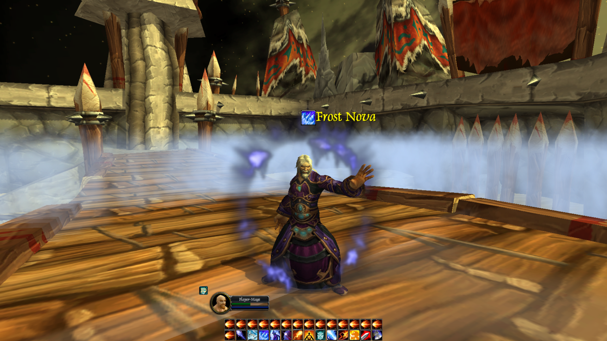

# Warcraft Arena
Converting old XNA/Unity 2D arena project from early university C# assignments to proper 3D World of Warcraft arena.

## Project status
**Done:**
- [X] Blades edge map
- [X] Mage model and animations setup
- [X] Character/camera controller

**Next:**
- [ ] Convert/Rewrite old XNA/Unity scripts
- [ ] Implement proper character/spell system
- [ ] Basic enemy AI
- [ ] Photon multiplayer

